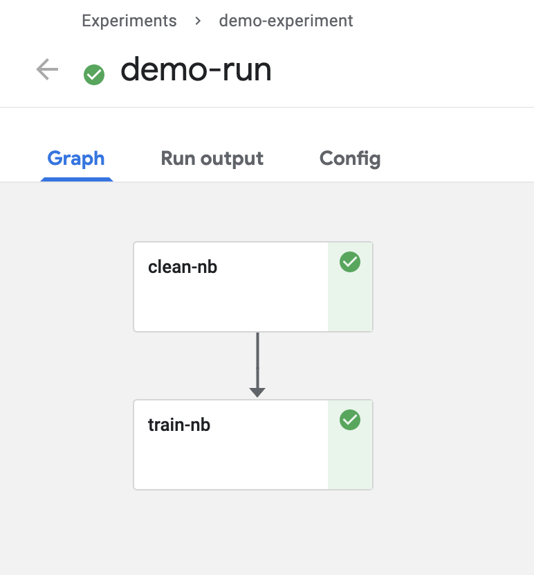
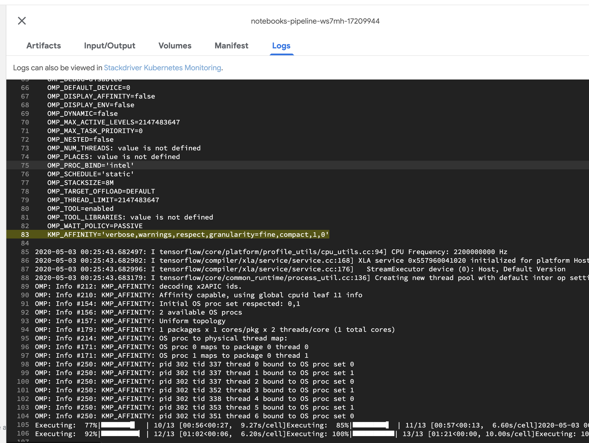
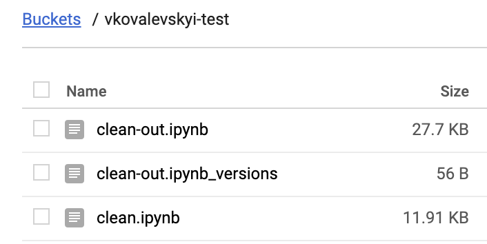

# KF Pipeline Fully Based On Notebooks

This pipeline has only two steps:
* [clean](./clean.ipynb)
* [train](./train.ipynb)

Each step is just a Notebook that is using GCS as a storage for sharing step results.

Pipeline itself is generated in the [pipeline.ipynb notebook](./pipeline.ipynb).

# Execution Result:

Run page:

Logs:

Bucket:

# Related packages:

This example based on top of:
* [noteline-kf](https://github.com/noteline-org/noteline-kf)
* [noteline-sdk-core](https://github.com/noteline-org/noteline-sdk-core)
* [noteline-schema](https://github.com/noteline-org/noteline-schema)
